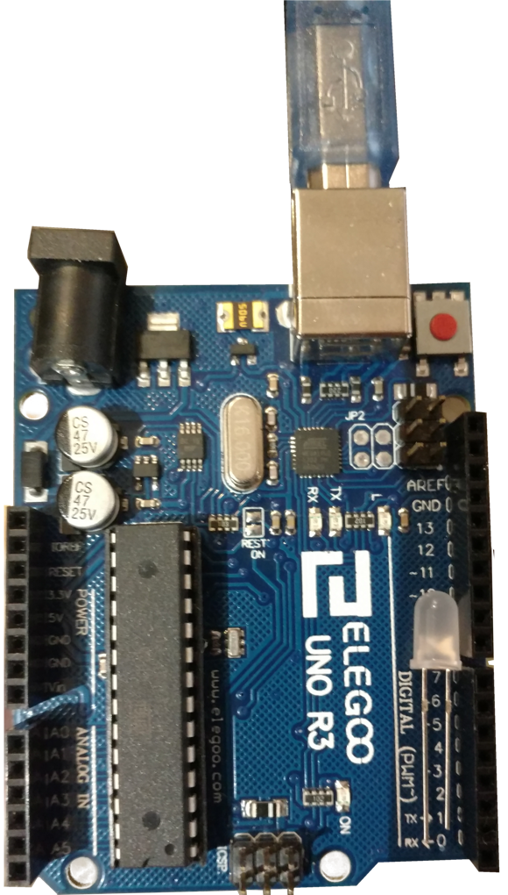

# Clignogo




Un petit projet pour faire clignoter une led en golang et en francais avec tinygo et un arduino.

## Matos

Un arduino, une led.

## Le sample

Pour commencer on va s'appuyer sur le sample présent ici :
https://tinygo.org/getting-started/using-docker/

Ce sample va nous permettre de faire clignoter une led.

### clone

On va récupérer ce repo pour avoir le code et builder notre executable :

```
git clone github.com/pmalhaire/clignogo
cd clignogo
```

### compilation

installer docker :

ubuntu

```
apt-get install docker
```

archlinux

```
sudo pacman -S docker
```

compiler le projet

```
docker run --rm -v $(pwd):/src tinygo/tinygo tinygo build -o /src/blinky1.hex -size=short -target=arduino /src/blinky1.go
```

si tout va bien on devrait avoir notre code dans `blinky1.hex`

### envoi au arduino

#### trouver la reference de notre arduino

1. brancher le arduino

2. executer la commande

```
dmesg | grep tty
```


la dernière ligne doit ressembler à :
```
[ 3402.044586] cdc_acm 1-7:1.0: ttyACM0: USB ACM device
```

notre arduino a donc la référence ttyACM0


#### installer avrdude

Pour communiquer avec notre arduino on a besoin du logiciel avrdude.

ubuntu

```
apt-get install avrdude
```

archlinux

```
sudo pacman -S avrdude
```

#### envoyer le programme

Pour envoyer le programme a notre arduino on va utiliser la référence précédente `ttyACM0`

```
sudo avrdude -p m328p -c arduino -P /dev/ttyACM0 -U flash:w:blinky1.hex
```

Le résultat doit ressembler à :

```
avrdude: AVR device initialized and ready to accept instructions

Reading | ################################################## | 100% 0.00s

avrdude: Device signature = 0x1e950f (probably m328p)
avrdude: NOTE: "flash" memory has been specified, an erase cycle will be performed
         To disable this feature, specify the -D option.
avrdude: erasing chip
avrdude: reading input file "blinky1.hex"
avrdude: input file blinky1.hex auto detected as Intel Hex
avrdude: writing flash (1692 bytes):

Writing | ################################################## | 100% 0.29s

avrdude: 1692 bytes of flash written
avrdude: verifying flash memory against blinky1.hex:
avrdude: load data flash data from input file blinky1.hex:
avrdude: input file blinky1.hex auto detected as Intel Hex
avrdude: input file blinky1.hex contains 1692 bytes
avrdude: reading on-chip flash data:

Reading | ################################################## | 100% 0.23s

avrdude: verifying ...
avrdude: 1692 bytes of flash verified

avrdude: safemode: Fuses OK (E:00, H:00, L:00)

avrdude done.  Thank you.
```

Maintenant la led de notre arduino clignote.


